<div align="center">

<table>
<tr>
<td valign="top"></td>
<td valign="top"></td>
</tr>
</table>

# Aditya Verma

**Backend Engineering · AI/ML · Inference Systems**

*Interested in ML systems, inference engineering, and making models behave in production.*

<br/>

[](https://www.adityavermaworks.in/)
[](https://www.linkedin.com/in/adityaverma9777/)
[](mailto:adityaverma9777@gmail.com)
[](https://instagram.com/chaii.samosa)

<br/>



</div>

<br/>

---

## About Me

```python
class Aditya:
    education   = "BCA"
    focus       = ["ML Systems", "Inference Engineering", "Backend Development"]
    learning    = ["Cloud Architecture", "Model Deployment", "Distributed Systems"]
    building    = "things that make models actually behave in production"
    open_source = "beginner — but getting there"
```

<br/>

---

## Tech Stack

**Languages** — Python, TypeScript, JavaScript, Java, C++

**AI / ML** — PyTorch, NumPy, Hugging Face

**Backend & Database** — FastAPI, Redis, PostgreSQL, MongoDB

**Frontend** — React, Next.js, Tailwind CSS, HTML5

**DevOps & Cloud** — Docker, Google Cloud, Git

<br/>

---

## GitHub Stats

<div align="center">


</div>

<br/>

---

## Currently

- Exploring inference optimization — quantization, batching, throughput
- Building backend APIs that serve ML models cleanly
- Learning cloud deployment patterns for ML workloads
- Starting my open-source journey — one PR at a time

<br/>

---

<div align="center">

*"The goal is not just to build models. It's to make them work when it counts."*

<br/>


</div>
